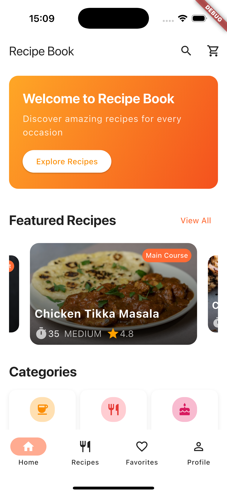
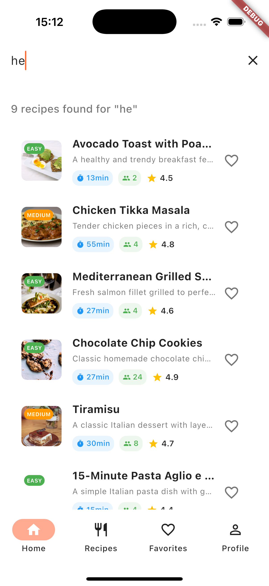
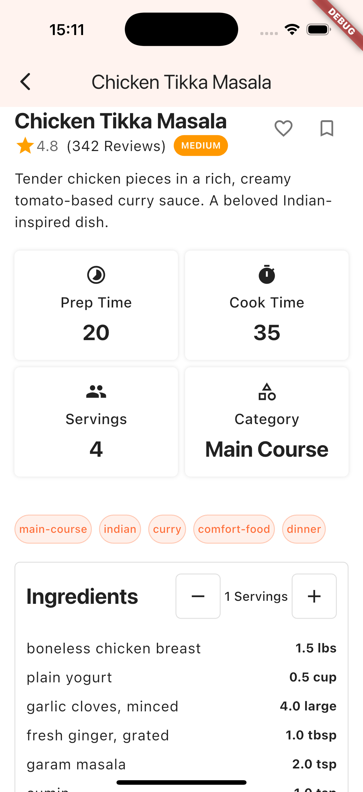
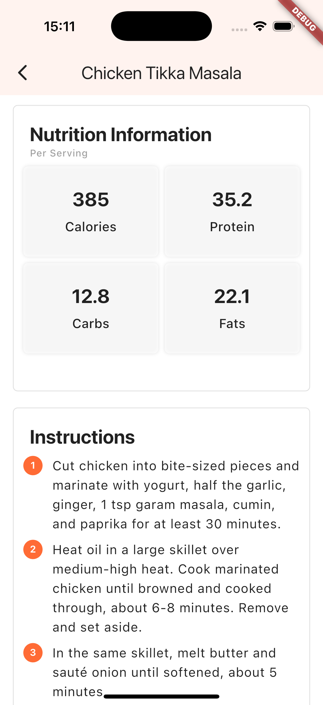
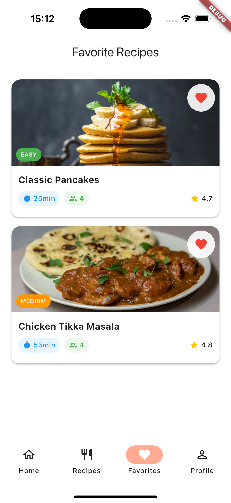
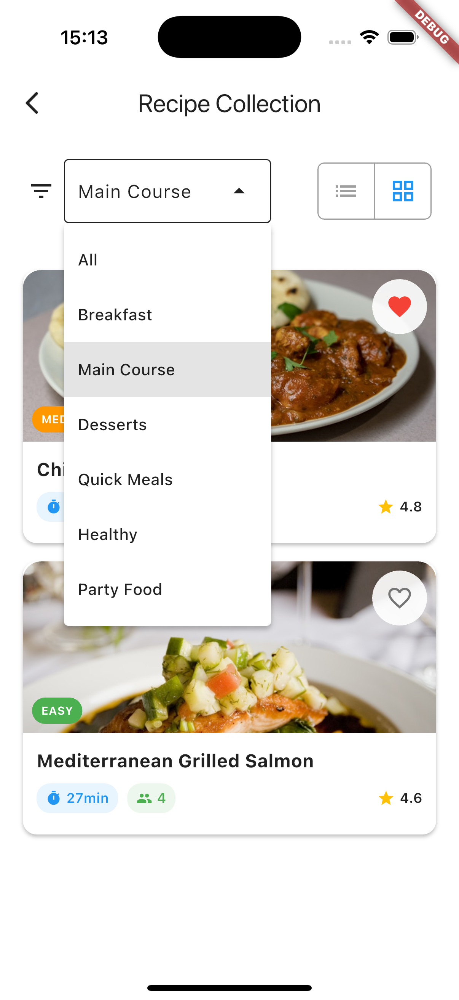

# Recipe Book

A modern, feature-rich recipe management app built with Flutter that provides an intuitive interface for discovering, organizing, and managing your favorite recipes with advanced search capabilities, nutritional information, and personalized favorites.


_Main interface showcasing recipe categories and featured recipes_

## Features

### 🍳 Core Recipe Management

- **Recipe Discovery**: Browse extensive collection of recipes with beautiful card layouts
- **Advanced Search**: Search by recipe name, ingredients, category, or dietary tags
- **Category Filtering**: Filter recipes by cuisine type, meal category, or dietary preferences
- **Detailed Recipe View**: Complete recipe information with ingredients, instructions, and nutrition facts
- **Serving Size Scaling**: Automatically adjust ingredient quantities for different serving sizes
- **Favorites System**: Save and organize your favorite recipes with persistent storage

### 📱 User Interface & Experience

- **Responsive Design**: Optimized layouts for mobile, tablet, and desktop screens
- **Grid & List Views**: Switch between grid and list view modes for recipe browsing
- **Interactive Recipe Cards**: Rich recipe cards with images, ratings, and quick actions
- **Smart Navigation**: Bottom navigation with responsive breakpoints and intuitive routing
- **Modern Material Design**: Clean, contemporary interface following Material Design guidelines


_Detailed recipe view with ingredients, instructions, and nutritional information_

### 🔍 Advanced Features

- **Real-time Search**: Instant search results with intelligent filtering
- **Nutritional Information**: Complete nutrition facts for each recipe
- **Cooking Time Display**: Prep time, cook time, and total time indicators
- **Difficulty Levels**: Easy-to-understand difficulty ratings for each recipe
- **Dietary Tags**: Vegetarian, vegan, gluten-free, and other dietary indicators
- **Recipe Scaling**: Dynamic ingredient quantity adjustment based on serving size


_Advanced search functionality and category browsing_

### 💾 Data Management

- **Persistent Favorites**: Local storage of favorite recipes using SharedPreferences
- **Recipe Caching**: Optimized image loading with caching for better performance
- **Category Management**: Organized recipe categorization system
- **Sample Data**: Rich collection of sample recipes for immediate app exploration

## Screenshots

|           Home Screen           |             Recipe List             |             Recipe Detail             |
| :-----------------------------: | :---------------------------------: | :-----------------------------------: |
|  |  |  |

|           Search Results            |                 Favorites                  |                Categories                 |
| :---------------------------------: | :----------------------------------------: | :---------------------------------------: |
|  |  |  |

## Technical Architecture

### 📁 Project Structure

```
lib/
├── main.dart                    # App entry point and theme configuration
├── data/
│   ├── recipe_categories.dart   # Recipe category definitions and data
│   └── sample_recipes.dart      # Sample recipe data and featured recipes
├── models/
│   ├── ingredient.dart          # Ingredient data model with scaling capabilities
│   ├── nutrition_info.dart      # Nutritional information data structure
│   └── recipe.dart              # Core recipe model with business logic
├── screens/
│   ├── home_screen.dart         # Main dashboard with search and featured content
│   ├── recipe_list_screen.dart  # Recipe browsing with filtering and view modes
│   ├── recipe_detail_screen.dart # Detailed recipe view with full information
│   ├── favorites_screen.dart    # User's saved favorite recipes
│   ├── profile_screen.dart      # User profile and settings
│   └── page_not_found.dart     # 404 error handling screen
├── widgets/
│   ├── common/
│   │   └── responsive_navigation.dart # Adaptive navigation component
│   ├── recipe/
│   │   ├── recipe_card.dart     # Recipe card components for grid view
│   │   └── recipe_card_list_view.dart # Recipe card for list view
│   └── search/                  # Search-related UI components
└── utils/
    ├── favourite_recipe_service.dart # Favorites management service
    ├── responsive_breakpoints.dart  # Screen size utilities
    ├── responsive_category_grid.dart # Responsive category layout
    └── responsive_recipe_grid.dart   # Responsive recipe grid layout
```

### 🏗️ Key Components

- **Recipe Model**: Comprehensive data structure with scaling and helper methods
- **FavouriteRecipeService**: Persistent storage service for user preferences
- **ResponsiveNavigation**: Adaptive navigation that adjusts to screen size
- **ResponsiveBreakpoints**: Utility class for handling different screen sizes
- **RecipeCard Components**: Reusable recipe display components for different layouts

### 🎨 Design System

```dart
// Color Palette
class AppColors {
  static const primary = Color(0xFFFF6B35);      // Vibrant orange
  static const primaryVariant = Color(0xFFE55100); // Darker orange
  static const secondary = Color(0xFFFFAB91);     // Light orange accent
  static const background = Color(0xFFFAFAFA);    // Light gray background
  static const surface = Colors.white;            // Card surfaces
}

// Typography Scale
class AppTextStyles {
  static const heading1 = TextStyle(fontSize: 32, fontWeight: FontWeight.bold);
  static const heading2 = TextStyle(fontSize: 24, fontWeight: FontWeight.bold);
  static const body = TextStyle(fontSize: 16, height: 1.5);
  static const caption = TextStyle(fontSize: 12, color: Colors.grey);
}
```

### 🔧 State Management

The app uses a combination of:

- **StatefulWidget**: For local component state management
- **SharedPreferences**: For persistent data storage (favorites)
- **Route Arguments**: For navigation state and data passing
- **Provider Pattern**: Service-based architecture for data management

## Getting Started

### Prerequisites

- Flutter SDK (>=3.7.2)
- Dart SDK
- Android Studio / VS Code with Flutter extensions
- iOS Simulator / Android Emulator or physical device

### Installation

1. **Clone the repository**

   ```bash
   git clone https://github.com/Damilarr/recipe_book.git
   cd recipe_book
   ```

2. **Install dependencies**

   ```bash
   flutter pub get
   ```

3. **Run the app**
   ```bash
   flutter run
   ```

### Building for Production

#### Android APK

```bash
flutter build apk --release
```

#### iOS (requires macOS and Xcode)

```bash
flutter build ios --release
```

#### Web

```bash
flutter build web
```

## Platform Support

| Platform   | Status       | Notes                      |
| ---------- | ------------ | -------------------------- |
| 📱 iOS     | ✅ Supported | Optimized for iPhone/iPad  |
| 🤖 Android | ✅ Supported | Material Design components |
| 🌐 Web     | ✅ Supported | Progressive Web App ready  |
| 💻 macOS   | ✅ Supported | Native desktop experience  |
| 🪟 Windows | ✅ Supported | Native Windows application |
| 🐧 Linux   | ✅ Supported | GTK-based application      |

## App Features in Detail

### Recipe Management

- **Complete Recipe Information**: Title, description, images, cooking times, difficulty
- **Ingredient Lists**: Detailed ingredients with quantities and scaling capabilities
- **Step-by-step Instructions**: Clear, numbered cooking instructions
- **Nutritional Data**: Calories, proteins, carbs, fats, and other nutritional information

### Search & Discovery

```dart
// Advanced search implementation
List<Recipe> _performSearch(String query) {
  final lowercaseQuery = query.toLowerCase();
  return sampleRecipes.where((recipe) {
    return recipe.title.toLowerCase().contains(lowercaseQuery) ||
           recipe.description.toLowerCase().contains(lowercaseQuery) ||
           recipe.category.toLowerCase().contains(lowercaseQuery) ||
           recipe.tags.any((tag) => tag.toLowerCase().contains(lowercaseQuery)) ||
           recipe.ingredients.any((ingredient) =>
             ingredient.name.toLowerCase().contains(lowercaseQuery));
  }).toList();
}
```

### Responsive Design

- **Mobile-first approach** with tablet and desktop optimizations
- **Adaptive layouts** that adjust based on screen size
- **Flexible grid systems** for optimal content display
- **Touch-friendly interfaces** with appropriate spacing and sizing

## Dependencies

| Package                | Version | Purpose                         |
| ---------------------- | ------- | ------------------------------- |
| `flutter`              | SDK     | Core Flutter framework          |
| `cupertino_icons`      | ^1.0.8  | iOS-style icons                 |
| `cached_network_image` | ^3.4.1  | Optimized network image loading |
| `shared_preferences`   | ^2.5.3  | Local data persistence          |
| `intl`                 | ^0.20.2 | Internationalization support    |
| `carousel_slider`      | ^5.1.1  | Image carousel components       |
| `flutter_lints`        | ^5.0.0  | Code quality and linting        |

## Development

### Code Style

This project follows [Dart style guidelines](https://dart.dev/guides/language/effective-dart/style) and uses `flutter_lints` for consistent code quality.

### Testing

```bash
# Run all tests
flutter test

# Run with coverage
flutter test --coverage
```

### Adding New Recipes

```dart
// Example of adding a new recipe to sample_recipes.dart
final newRecipe = Recipe(
  id: 'unique_recipe_id',
  title: 'Recipe Name',
  description: 'Recipe description',
  imageUrl: 'https://example.com/image.jpg',
  cookTimeMinutes: 30,
  prepTimeMinutes: 15,
  servings: 4,
  difficulty: 'medium',
  ingredients: [/* ingredient list */],
  instructions: [/* instruction steps */],
  nutritionInfo: NutritionInfo(/* nutrition data */),
  category: 'Main Course',
  createdAt: DateTime.now(),
);
```

## Performance Optimizations

- **Image Caching**: `cached_network_image` for efficient image loading and caching
- **Lazy Loading**: ListView builders for efficient memory usage with large recipe lists
- **Responsive Grids**: Adaptive grid layouts that optimize for different screen sizes
- **State Management**: Efficient state management to minimize unnecessary rebuilds

## Contributing

1. Fork the repository
2. Create your feature branch (`git checkout -b feature/amazing-feature`)
3. Commit your changes (`git commit -m 'Add some amazing feature'`)
4. Push to the branch (`git push origin feature/amazing-feature`)
5. Open a Pull Request
